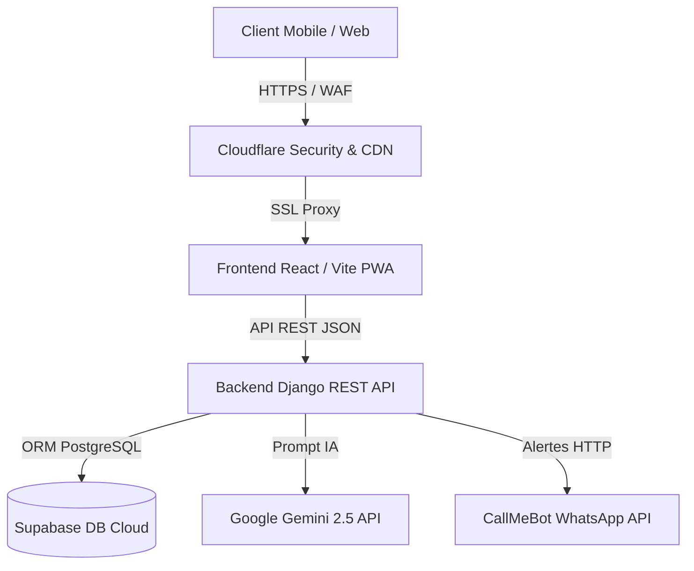

# 📘 Documentation Technique & Fonctionnelle Complète (SaaS ERP / CRM / AI)
**Produit** : Hadara Suite (Studio, Manager, AI Pro, Cloud)
**Version** : 2.0.0 (SaaS Industrial Edition)
**Dernière mise à jour** : Juillet 2026

Cette documentation décrit l'ensemble de l'architecture, du fonctionnement, des 4 espaces produits et des processus de déploiement de **Hadara Suite**.

---

## 📑 Sommaire
1. [Présentation du Produit & Vision SaaS](#1-présentation-du-produit--vision-saas)
2. [Les 4 Espaces Produit](#2-les-4-espaces-produit)
3. [Architecture Technique Globale](#3-architecture-technique-globale)
4. [Le Frontend (React / Vite PWA & Responsive Mobile-First)](#4-le-frontend-react--vite-pwa--responsive-mobile-first)
5. [Le Backend (Django REST Framework & Persistence Multi-Tenant)](#5-le-backend-django-rest-framework--persistence-multi-tenant)
6. [Hadara AI Studio & Directeur Artistique IA](#6-hadara-ai-studio--directeur-artistique-ia)
7. [Sécurité, Rôles (RBAC) & Audit Trail](#7-sécurité-rôles-rbac--audit-trail)
8. [Guide de Lancement & Déploiement (Render + Cloudflare)](#8-guide-de-lancement--déploiement-render--cloudflare)
9. [Structure des Dossiers](#9-structure-des-dossiers)

---

## 1. Présentation du Produit & Vision SaaS

**Hadara Suite** est une plateforme intégrée d'ERP, CRM, Copilote IA et Console Cloud d'éditeur, spécialement conçue pour les studios graphiques, agences de communication et créatifs freelances.

### Valeur Ajoutée
- **Pour le Client** : Brief guidé en 5 étapes, suivi en temps réel sur le **Portail Client**, révision des livrables (V1, V2, HD), signature électronique et téléchargement des BAT.
- **Pour le Studio Graphique** : Gestion complète du workflow (Brief ➔ Devis ➔ Acompte 50% ➔ Production Kanban ➔ Validation ➔ Solde 50% ➔ Livraison), génération de factures PDF, bibliothèque d'assets (Polices, Mockups 3D, Palettes).
- **Pour l'Éditeur SaaS (Hadara Cloud)** : Administration multi-studios, suivi des métriques d'abonnements (**MRR, ARR, Churn Rate**), gestion des licences et tickets support.

---

## 2. Les 4 Espaces Produit

| Espace Produit | Vocation & Fonctionnalités | Composants Clés |
| :--- | :--- | :--- |
| **🎨 Hadara Studio** | Vitrine, conversion client, portfolio Bento Grid, CV interactif 5 Étoiles & badges, formulaire intelligent en 5 étapes. | `LandingHero`, `PortfolioShowcase`, `ResumeCV`, `BriefForm` |
| **⚙️ Hadara Manager** | ERP / CRM de production : Kanban 6 étapes, Fiche 360°, Finance PDF, Calendrier des livraisons, Recherche `Cmd+K`, Corbeille Soft-Delete. | `AdminDashboard`, `KanbanTab`, `Project360Modal`, `FinanceTab`, `CRMTab`, `GlobalSearchModal`, `TrashBinModal` |
| **🤖 Hadara AI Pro** | Copilote créatif & Directeur Artistique IA : Prompts Midjourney/Firefly/DALL-E, Social Copywriter, Audit de texte/densité, Score Qualité /100. | `HadaraAICenterTab` |
| **☁️ Hadara Cloud** | Administration multi-tenant SaaS d'éditeur : Métriques MRR/ARR/Churn, Onboarding multi-studios, licences White-Label, tickets support. | `HadaraCloudTab`, `StudioOnboardingModal` |

---

## 3. Architecture Technique Globale

L'application repose sur un découpage strict et modulaire :

- **Frontend** : SPA + PWA construite avec **React 18**, **TypeScript**, **Tailwind CSS (v4)** et **Vite**.
- **Backend API** : Python 3.10+ avec **Django REST Framework (DRF)**.
- **Base de Données** : **Supabase (PostgreSQL Cloud)** gérée via l'ORM Django (avec support SQLite en local).
- **Hébergement & CDN** : Déploiement continu sur **Render** protégé par la couche de sécurité et CDN **Cloudflare** (SSL Full Mode).



---

## 4. Le Frontend (React / Vite PWA & Responsive Mobile-First)

### Caractéristiques Majeures
- **CV Interactif Professionnalisé (`ResumeCV.tsx`)** : Suppression des pourcentages subjectifs au profit d'un système de notation à 5 étoiles (`★`) et badges professionnels (**Expert**, **Maîtrise avancée**, **Bonne maîtrise**, **Notions**), complétés par les cas d'usages réels pour chaque outil Adobe.
- **Header & Navigation Responsive** : Barre d'onglets de navigation à défilement horizontal ultra-fluide (`overflow-x-auto min-w-max`) avec corrections de conteneurs Flexbox (`w-full min-w-0`) pour une compatibilité parfaite avec Safari macOS / iOS.
- **Contrôle WhatsApp Compact** : Boîte de disponibilité WhatsApp ultra-discrète en 1 ligne sur mobile.
- **Grille KPI Compacte** : 4 cartes d'indicateurs synthétiques (Briefs, Projets, Devis, Revenu FCFA) optimisées en 2x2.

---

## 5. Le Backend (Django REST Framework & Persistence Multi-Tenant)

### Modèles & Intégrité des Données
- **Briefs & Projets (`BriefData`)** : Persistance intégrale des versions de livrables (V1, V2, HD), de l'historique d'activité (`activityLog`), des checklists qualité 5 points (`qualityChecklist`), de l'identité de marque du client (`clientBranding`) et des révisions.
- **Soft-Delete (Corbeille)** : Suppression non destructrice (`isDeleted=True`) permettant la restauration instantanée depuis la corbeille `TrashBinModal`.
- **Facturation & Finance (`InvoiceData`)** : Gestion des acomptes 50%, soldes 50% et modes de paiement locaux (Wave Sénégal, Orange Money, Free Money, Espèces, Virement).

---

## 6. Hadara AI Studio & Directeur Artistique IA

Le centre d'Intelligence Artificielle autonome (**Hadara AI Studio**) fournit 4 outils de productivité créative :

1. **Générateur de Prompts IA** : Prompts structurés et optimisés pour Midjourney v6, Adobe Firefly, DALL-E 3 et Stable Diffusion (style, éclairage, optique, cadrage).
2. **Copywriter Réseaux Sociaux** : Rédaction automatique d'accroches, corps de texte et hashtags adaptés aux événements (Gamou, Magal, Ziarra, Entreprises).
3. **Audit de Texte & Densité** : Analyse du nombre de mots pour éviter la surcharge d'information sur les affiches et bâches grand format.
4. **Score Qualité /100** : Évaluation du brief et recommandations de lisibilité.

---

## 7. Sécurité, Rôles (RBAC) & Audit Trail

### Matrice de Rôles RBAC
L'application gère 8 niveaux de permissions affinés (`UserRole`) :
- `super_admin` : Accès global à l'ensemble du système et d'Hadara Cloud.
- `studio_owner` : Propriétaire d'un studio abonné, gestion de l'équipe et de la comptabilité.
- `directeur_artistique` : Validation des livrables, attribution des projets et contrôle qualité.
- `graphiste_senior` & `graphiste_junior` : Production, téléversement des versions et checklists.
- `commercial` & `comptable` : Gestion des briefs, devis, relances et factures.
- `client` : Accès restreint au **Portail Client** pour le suivi, la validation et la signature des devis.

### Journal d'Audit (`ActivityLogItem`)
Toutes les actions sensibles (changement de statut, téléversement de fichier, modification du devis, signature électronique) sont horodatées et consignées de manière inaltérable.

---

## 8. Guide de Lancement & Déploiement

### Lancement Local
```bash
# Frontend
npm install
npm run dev

# Backend
cd backend
python3 -m venv venv
source venv/bin/activate
pip install -r requirements.txt
python manage.py migrate
python manage.py runserver
```

### Déploiement Continu (Render + GitHub + Cloudflare)
Chaque push sur la branche `main` déclenche le build de production automatique :
- **Frontend Build** : `npm run build` (génère les bundles optimisés dans `dist/`).
- **Domain HTTPS** : Protégé par SSL Cloudflare sur **[hadara-design.com](https://hadara-design.com)**.

---

## 9. Structure des Dossiers

```text
Hadara Brief - Graphisme & Design/
│
├── src/
│   ├── components/
│   │   ├── admin/                 # Modules ERP/CRM & SaaS
│   │   │   ├── KanbanTab.tsx            # Tableau Kanban 6 étapes
│   │   │   ├── Project360Modal.tsx      # Fiche Projet 360°
│   │   │   ├── FinanceTab.tsx           # Factures & Comptabilité
│   │   │   ├── CalendarTab.tsx          # Calendrier des livraisons
│   │   │   ├── NotificationsTab.tsx     # Centre de notifications
│   │   │   ├── ResourceLibraryTab.tsx   # Bibliothèque d'assets
│   │   │   ├── HadaraAICenterTab.tsx    # Studio IA Directeur Artistique
│   │   │   ├── HadaraCloudTab.tsx       # Console SaaS Admin
│   │   │   ├── BusinessIntelligenceTab.tsx # Dashboard BI & Metrics
│   │   │   ├── GlobalSearchModal.tsx    # Recherche Cmd+K
│   │   │   ├── TrashBinModal.tsx        # Corbeille Soft-Delete
│   │   │   └── ESignatureModal.tsx      # Signature Électronique
│   │   │
│   │   ├── client/                # Portail Client public
│   │   │   └── ClientPortalView.tsx     # Suivi & Validation Client
│   │   │
│   │   ├── LandingHero.tsx        # Accueil Vitrine & Bento Grid
│   │   ├── PortfolioShowcase.tsx  # Galerie des réalisations
│   │   ├── ResumeCV.tsx           # CV 5-Star Badges & Usages Réels
│   │   ├── BriefForm.tsx          # Formulaire Brief 5 étapes
│   │   └── AdminDashboard.tsx     # Tableau de bord principal
│   │
│   ├── types.ts                   # Modèles de données TypeScript
│   └── main.tsx                   # Point d'entrée React
│
├── backend/                       # API Django REST
│   ├── api/                       # Endpoint briefs, templates & IA
│   ├── hadara_project/            # Paramètres Django & Supabase
│   └── manage.py                  # CLI Django
│
├── DOCUMENTATION.md               # Documentation Technique & Fonctionnelle
└── README.md                      # Guide rapide GitHub
```

---
*Fin de la documentation technique Hadara Suite v2.0.0.*
