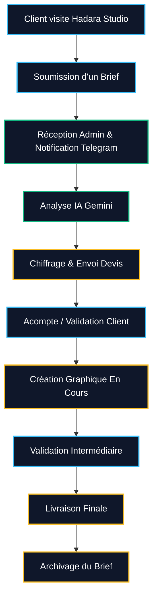

# Documentation Métier (Business)

> [!WARNING]  
> **Clause de Stricte Réalité** : Cette section décrit les processus métiers supportés par l'application actuelle. Les étapes qui se déroulent hors-logiciel (comme la validation ou le paiement) sont indiquées pour la compréhension du cycle global.

---

## 1. Cycle de vie d'un Projet Créatif (Workflow)

Le logiciel Hadara Suite est conçu pour accompagner le processus métier standard du graphiste. Voici comment un projet est traité, de son acquisition à sa clôture.

### Étape 1 : Acquisition & Brief (`Client`)
Le prospect visite le site (`/studio`), consulte le portfolio, et décide de lancer un projet. Il remplit le **Brief Intelligent**. Le système génère un ID unique (`HAD-0001`).

### Étape 2 : Analyse Initiale (`Système` & `IA`)
L'application envoie instantanément une alerte Telegram à l'administrateur. Dans le tableau de bord, l'administrateur déclenche l'**Analyse IA** qui décode le brief et génère :
*   Des angles créatifs (Concepts).
*   Une estimation de budget (pour aider l'administrateur).

### Étape 3 : Chiffrage & Devis (`Admin`)
L'administrateur définit manuellement un prix ferme (en FCFA) et change le statut du Brief à "En Cours" ou "En Attente de Paiement". Le client peut voir ce prix depuis le Portail Client.

### Étape 4 : Acompte & Création (`Admin` & `Client`)
*(Étape hors-logiciel)* : Le client valide le devis et effectue un paiement (Wave/Orange Money). L'administrateur démarre la phase de design (illustrateur, photoshop, etc.).

### Étape 5 : Validation & Livraison (`Admin`)
Les itérations avec le client se font (via WhatsApp/Email). Une fois le design validé, l'administrateur passe le statut du brief à **Terminé**. Le projet est archivé et peut être potentiellement transformé en *Portfolio Item* pour vitrine future.

---

## 2. Le Modèle Kanban (Hadara Manager)

Le tableau de bord permet de visuellement déplacer et catégoriser les clients en temps réel pour ne perdre aucune requête métier.

1.  **Nouveau** : Lead entrant, n'a pas encore été analysé ni qualifié.
2.  **En Attente** : Projet qualifié, mais en attente du client (signature, paiement de l'acompte, ressources manquantes).
3.  **En Cours** : Production active du graphisme.
4.  **Terminé** : Livrables expédiés au client, solde payé, projet archivé.
