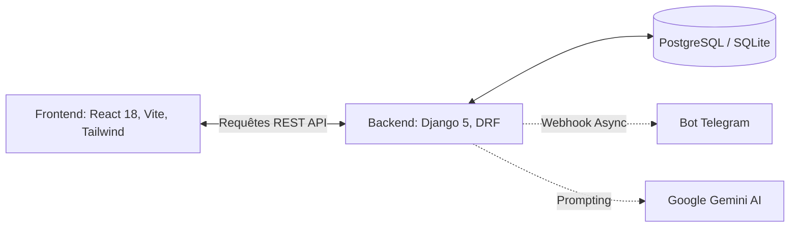

# Guide Développeur & Architecture Technique

> [!WARNING]  
> **Clause de Stricte Réalité** : Cette documentation est générée à partir de l'état actuel du code source. Les concepts abstraits non implémentés ne sont pas documentés ici.

---

## 1. Stack Technologique (Architecture Monolithique Découplée)

---

## 2. Conventions du Projet

### A. Conventions de Nommage
*   Les IDs générés en base de données suivent une syntaxe lisible par l'humain pour être partageables avec le client :
    *   **Brief Client** : `HAD-0001`, `HAD-0002`
    *   **Produit Boutique** : `PRD-0001`, `PRD-0002`
    *   **Réalisation Portfolio** : `PRT-0001`, `PRT-0002`

### B. Conventions Git
*   **Branches** :
    *   `main` : Code de production (déploiement automatique sur Render).
*   **Commits** : Conventionnal Commits obligatoires.
    *   `feat:` Ajout de fonctionnalité.
    *   `fix:` Correction de bug.
    *   `refactor:` Refonte structurelle.
    *   `docs:` Documentation.

---

## 3. Schémas de Base de Données (`models.py`)

1.  **`Brief`** : Contient toutes les infos du client, le statut (nouveau, en_cours, etc.), et les retours de l'IA (`ai_analysis`).
2.  **`PortfolioItem`** : Modèle du portfolio.
3.  **`StoreProduct`** : Modèle de la boutique avec `status` limités (`in_stock`, `on_order`, etc.).
4.  **`Template`** : Modèle de templates pré-remplis pour les requêtes rapides.

---

## 4. Glossaire & Lexique

Ce projet utilise des termes spécifiques à comprendre impérativement par les développeurs et chefs de projet.

*   **API (Application Programming Interface)** : Couche de communication entre React et Django.
*   **Brief** : Formulaire détaillé représentant la demande initiale d'un client. C'est le cœur de l'application Hadara Suite.
*   **CRM (Customer Relationship Management)** : La vue Kanban (`/admin`) agit comme le CRM interne du studio.
*   **CRUD** : Create, Read, Update, Delete. Les 4 opérations de base implémentées dans les ViewSets DRF.
*   **DRF (Django Rest Framework)** : Bibliothèque Python utilisée sur le backend pour générer l'API REST.
*   **Gemini** : L'intelligence artificielle de Google (modèle 2.5 Flash) utilisée par le backend pour analyser les briefs clients.
*   **Kanban** : Méthodologie visuelle utilisée dans le Dashboard pour faire passer les briefs de colonne en colonne (Nouveau -> Terminé).
*   **PWA (Progressive Web App)** : La Hadara Suite peut être installée comme une application mobile native sur iOS/Android.
*   **Token Statique** : La méthode d'authentification actuelle. L'administrateur reçoit un token défini dans les variables d'environnement (`ADMIN_STATIC_TOKEN`) pour valider les requêtes.
*   **Webhook / Asynchrone** : Mécanisme utilisé par Django (via la librairie native `threading`) pour envoyer des alertes sur l'API de Telegram sans ralentir la réponse web.
