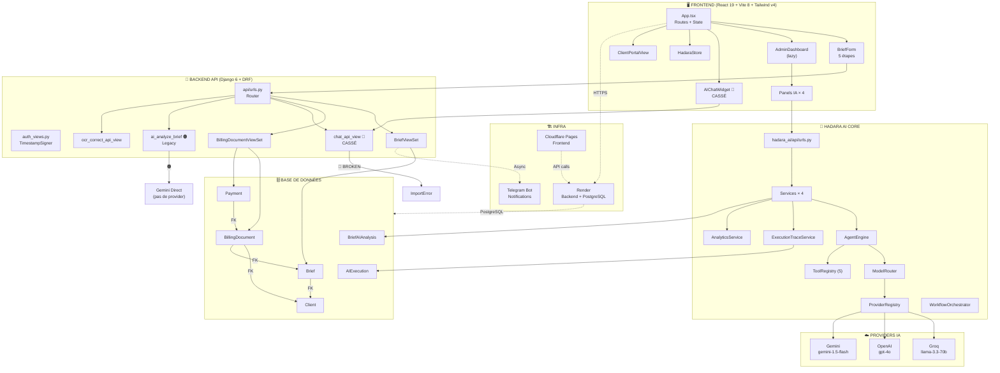
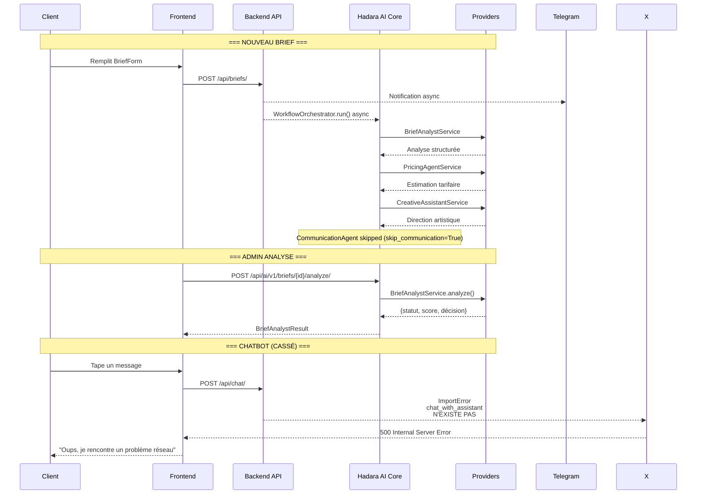

# 12 — Carte Mère

> Hadara Suite v2.3.0 — Diagramme complet du SaaS actuel
> Date : 2026-08-26 | Source : Vérifié par 10_CROSSCHECK.md

---

## Architecture Globale



---

## Flux Métier



---

## Matrice des endpoints

```mermaid
mindmap
  root((Hadara Suite))
    Métier
      Briefs
        GET /api/briefs/
        POST /api/briefs/
        PATCH /api/briefs/{id}/
      Clients
        GET /api/billing/clients/
        POST /api/billing/clients/
      Facturation
        GET /api/billing/documents/
        GET /api/billing/payments/
        POST /api/billing/payments/
      Boutique
        GET /api/store/products/
    Auth
      Login Admin
        POST /api/auth/login/
        GET /api/auth/verify/
      Login Client
        POST /api/auth/client/login/
    IA Core
      Agents
        GET /api/ai/v1/agents/
        POST /api/ai/v1/agents/{pk}/run/
      Brief Analysis
        POST /api/ai/v1/briefs/{id}/analyze/
      Pricing Agent
        POST /api/ai/v1/briefs/{id}/pricing-agent/
      Creative Assistant
        POST /api/ai/v1/briefs/{id}/creative-assistant/
      Communication Agent
        POST /api/ai/v1/briefs/{id}/communicate/
      Workflow
        POST /api/ai/v1/briefs/{id}/workflow/
      Analytics
        GET /api/ai/v1/analytics/dashboard/
        GET /api/ai/v1/analytics/agents/
    Legacy
      Chat 🔴
        POST /api/chat/
      AI Analyze 🟠
        POST /api/ai-analyze/{pk}/
      OCR
        POST /api/ocr-correct/
```
